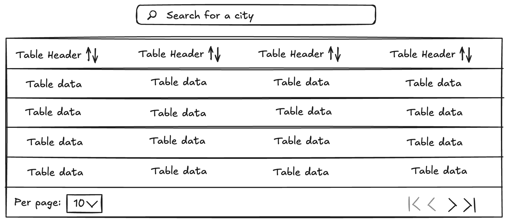
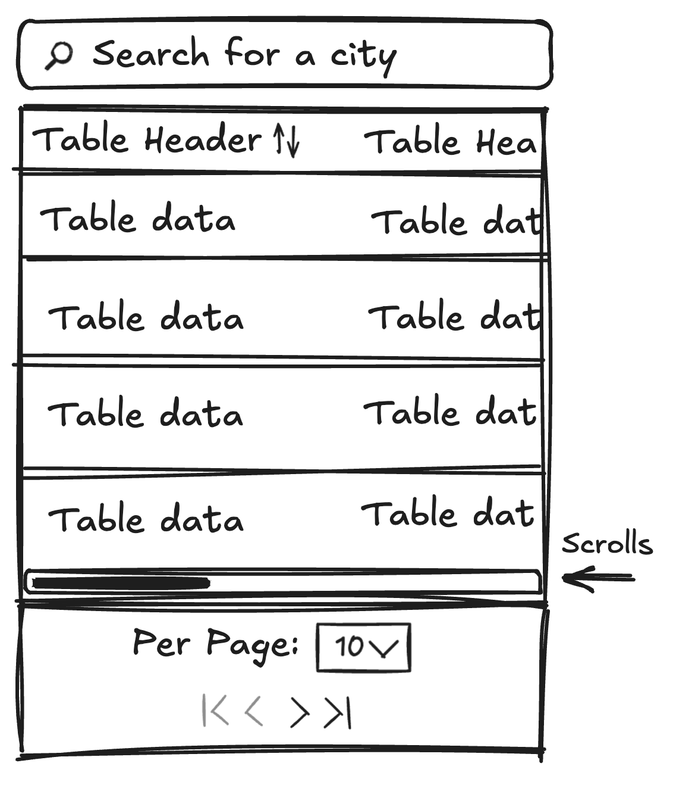

# Sortable Table

## Project

### Stack

- [TypeScript](https://www.typescriptlang.org)
- [React](https://reactjs.org)
- [Jest](https://jestjs.io)
- [Tailwind](https://tailwindcss.com/docs/installation)
- [Vite](https://vitejs.dev/)
- [React Icons](https://react-icons.github.io/react-icons/)
- [ESLint](https://eslint.org/)
- [Prettier](https://prettier.io/)

### Available Scripts

In the project directory, you can run:

#### `npm run dev`

Runs the app in the development mode.
Open [http://localhost:5173/](http://localhost:5173/) to view it in the browser.

The page will reload if you make edits.
You will also see any lint errors in the console.

#### `npm run test`

Runs a small suite of [Jest](https://jestjs.io) tests.

#### `npm run lint`

Runs [ESLint](https://eslint.org/). There is also an auto-fix command if you run `npm run lint:fix`.

#### `npm run format`

Runs [Prettier](https://prettier.io/)

### Mockups

<details>
  <summary>
  Large screen mockup
  </summary>

</details>

<details>
  <summary>
  Small screen mockup
  </summary>
  
</details>

## Architecture

### Component Structure

```
src/
├── components/
│   ├── CityTable/          # Sortable table with ARIA support
│   ├── Pagination/         # Pagination controls
│   └── SearchInput/        # Debounced search input
├── utils/
│   ├── sort.ts            # Sorting utilities (tested)
│   ├── paginate.ts        # Pagination utilities (tested)
│   └── debounce.ts        # Custom debounce implementation
└── api/
    └── getCities.ts       # Enhanced API with search & count
```

### Key Design Decisions

1. **Client-Side Processing**: All sorting and pagination happens in the browser for instant feedback
2. **Custom Utilities**: Implemented debounce, sort, and pagination without external dependencies
3. **Accessibility First**: Full ARIA support with keyboard navigation
4. **Mobile Responsive**: Horizontal scroll for table, adaptive pagination controls
5. **Type Safety**: Comprehensive TypeScript coverage

## Performance Optimizations

- **Debounced Search**: 150ms delay prevents excessive API calls
- **Memoized Callbacks**: Prevents unnecessary re-renders
- **Client-Side Caching**: Search results cached for instant sorting/pagination
- **Efficient Sorting**: Stable sort with proper type handling

## Accessibility Features

- **ARIA Roles**: `table`, `row`, `columnheader`, `gridcell`
- **Sort Indicators**: `aria-sort` attributes for screen readers
- **Keyboard Navigation**: Full keyboard support for all controls
- **Focus Management**: Clear focus indicators and logical tab order
- **Screen Reader Support**: Descriptive labels and live regions

## Mobile Responsiveness

### Adaptive Layout System

- **Desktop (≥1024px)**: Full table layout with all columns visible
- **Tablet (640px-1023px)**: Horizontal scrolling table with optimized spacing
- **Mobile (<640px)**: Card-based layout with dedicated sort controls

### Mobile-First Features

- **Card Layout**: Cities displayed as individual cards on mobile
- **Touch-Friendly Controls**: Large touch targets (minimum 44px)
- **Mobile Sort Controls**: Dedicated sort buttons above cards
- **Responsive Typography**: Scales appropriately across devices
- **Optimized Spacing**: Reduced padding and margins on smaller screens
- **iOS Safari Support**: Prevents zoom on input focus (16px font size)

### Responsive Breakpoints

- **Small (sm)**: 640px and up
- **Medium (md)**: 768px and up
- **Large (lg)**: 1024px and up
- **Extra Large (xl)**: 1280px and up

## Testing Strategy

- **Unit Tests**: Core utilities (`sort.ts`, `paginate.ts`) fully tested
- **Edge Cases**: Null values, empty data, boundary conditions
- **Type Safety**: TypeScript catches type-related issues
- **Manual Testing**: Cross-browser and device testing

## Tradeoffs & Future Improvements

### Current Tradeoffs

1. **Memory vs Performance**: Client-side processing uses more memory but provides instant feedback
2. **Bundle Size**: ~2MB bundle (mostly city data) vs server-side filtering
3. **Fixed Page Size**: Simpler implementation vs user customization

### Future Enhancements

1. **Virtual Scrolling**: For very large datasets
2. **Server-Side Processing**: For datasets > 100k items
3. **Column Customization**: Show/hide columns, reordering
4. **Advanced Filtering**: Date ranges, multiple criteria
5. **Export Functionality**: CSV/Excel export
6. **Infinite Scroll**: Alternative to pagination

